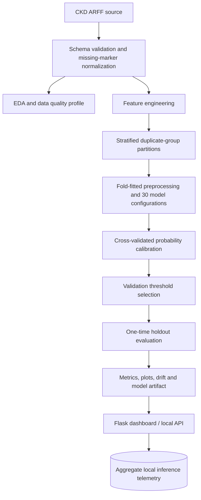

# Sentinel Health CKD Data Flow

```mermaid
flowchart TD
  ARFF[CKD ARFF source] --> LOAD[Schema validation and missing-marker normalization]
  LOAD --> EDA[EDA and data quality profile]
  LOAD --> FE[Feature engineering]
  FE --> SPLIT[Stratified duplicate-group partitions]
  SPLIT --> CV[Fold-fitted preprocessing and 30 model configurations]
  CV --> CAL[Cross-validated probability calibration]
  CAL --> VAL[Validation threshold selection]
  VAL --> HOLDOUT[One-time holdout evaluation]
  HOLDOUT --> OUTPUT[Metrics, plots, drift and model artifact]
  OUTPUT --> APP[Flask dashboard / local API]
  APP --> LOG[(Aggregate local inference telemetry)]
```

Raw records are not written to telemetry. This benchmark is educational and not for clinical decisions.
